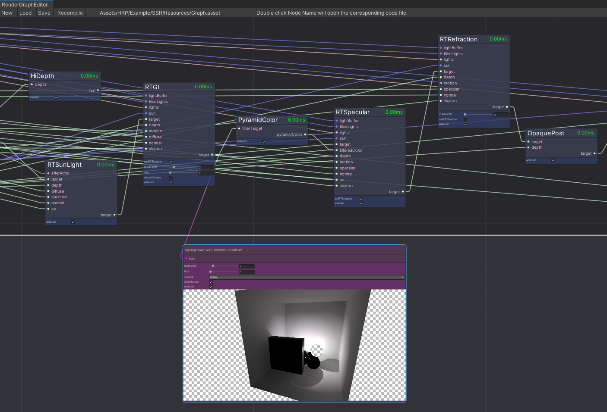

# Hypnos Render Graph



**HRG** (Hypnos Render Graph) is a graph system used by HRP to built the entire render pipeline.

HRG is responsible for resources auto reuse and life cycle management. It also supports some useful features like performance profiling or intermediate result debug.

It has two different back ends. In editor, reflection is used to execute HRG by default. When building the application, a code generator is automatically used instead of runtime reflection.

## User guide

The implementations of all the passes is under ```./RenderPass/Implementations/```.

### Minimal Example

Here is a minimal example of writing an HRG render node.

```c#
namespace HypnosRenderPipeline.RenderPass {
    //[RenderNodePath("RenderPass")] // path used in Render Graph Editor, For 'BaseRenderPass', this value is 'RenderPass' by default.
    //[RenderNodeInformation("")]    // node tooltips
    //[NodeColor(0, 0.2f, 1, 0.4f)]  // node color used Render Graph Editor
    public class PreZ : BaseRenderPass {        
        [NodePin(PinType.InOut)]     // node pin arttribute
        public TexturePin depth = new TexturePin(new RenderTextureDescriptor(1, 1, RenderTextureFormat.Depth, 24),
                                                        SizeCastMode.ResizeToInput,
                                                        ColorCastMode.Fixed,
                                                        SizeScale.Full);
        public LayerMask mask = -1; // node parameter
        public override void Execute(RenderContext context) { // execute function
            var cb = context.commandBuffer;
            cb.SetRenderTarget(depth);
            if (!depth.connected) cb.ClearRenderTarget(true, false, Color.black);
            
            var a = new DrawingSettings(new ShaderTagId("PreZ"), new SortingSettings(context.camera));
            var b = FilteringSettings.defaultValue;
            b.layerMask = mask.value;
            b.renderQueueRange = RenderQueueRange.opaque;
            cb.DrawRenderers(context.defaultCullingResult, ref a, ref b);
        }
    }
}
```


By defining such a 'Render Node', you will get a new node type in Render Graph Editor. Connect it to the graph then everything just running.

### Graph Editor


You can switch the currently used Graph in the **Pipeline Asset** panel.

You can also force HRP to use compiler in editor instead of using reflection for HRG execution.


The final rendering result should be connected to the **OutputNode**. If a node has no available path to the final **OutputNode**, it will probably be culled (when using compiling, will definitely be culled).

### Short cut

```F``` Focus on.

```Ctrl C``` Copy.

```Ctrl V``` Paste.

```G``` Group.

```R``` Remove from Group.

```Ctrl Z``` Undo.

```Ctrl Y``` Redo.

```Space``` Create Node.

```Del``` Delete.