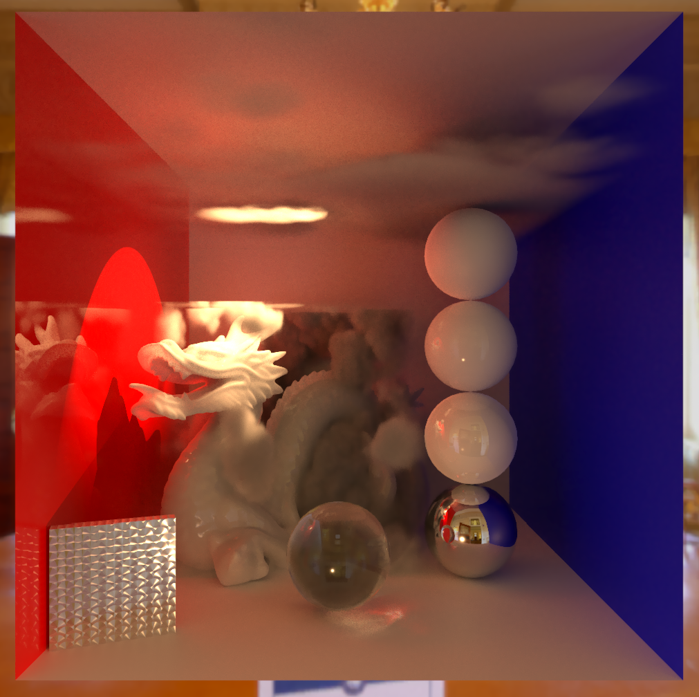

# VRender




**VRender** is a progressive off-line renderer integrated in HRP. It supports common render features of commercial renderers and will produce an almost unbiased result of the scene.

VRender supports all the **Default Lit** materials in HRP, including those generated with **Shader Graph**.

## User guide


When using VRender, there will be an **RTX ON** logo at the top right of the screen. Click this logo, you will get the detailed control panel.


By using VRender, you can get a cinematic render quality. This renderer could be used as the ground-truth reference for the real-time graphic development.

### Short cut

```Ctrl Shif V``` Switch VRender on/off.

```Alt Ctrl Shif V``` Force re-render.