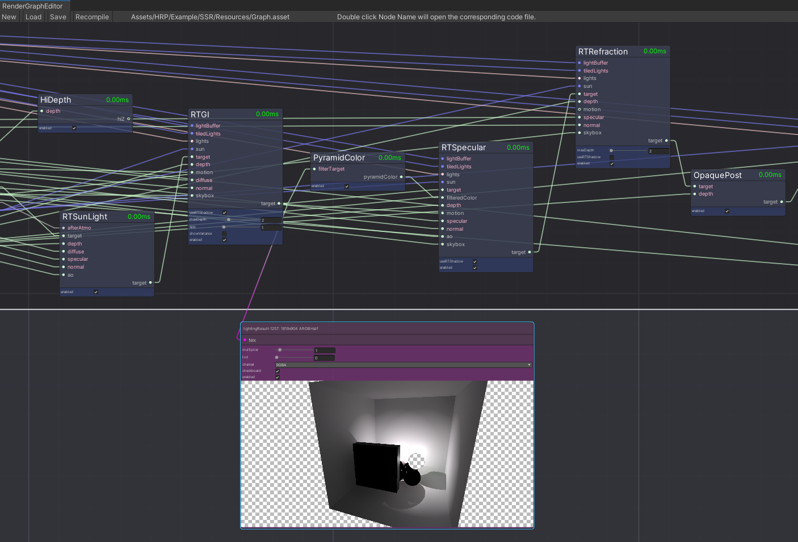
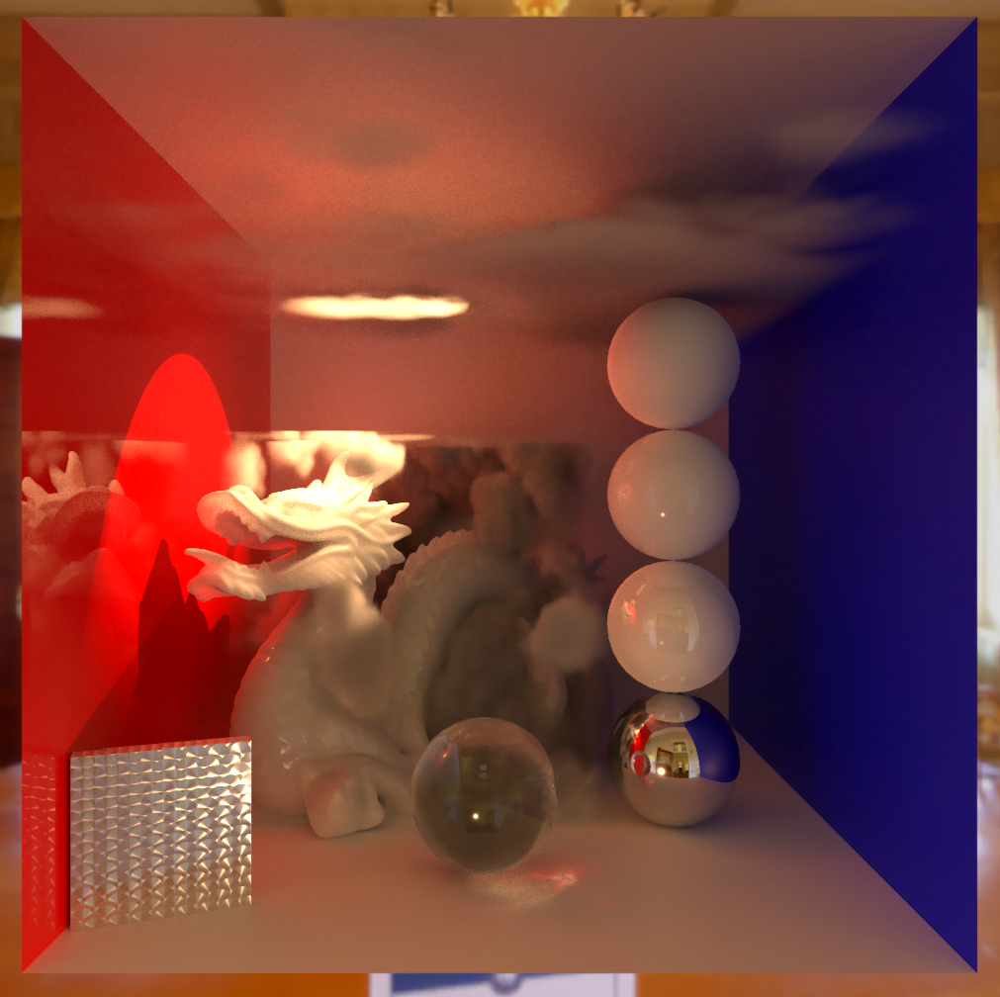
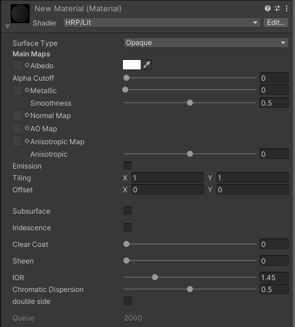
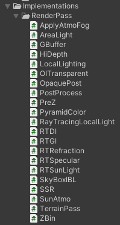

# Hypnos Render Pipeline

## About HRP

**HRP** (Hypnos Render Pipeline) is a **Hybrid Render Pipeline** that combines **Rasterization** and **RayTracing** features. It based on **HRG** (Hypnos Render Graph), thus render features can be easily removed or plug in.

> HRP is based on [GNU GENERAL PUBLIC LICENSE](./LICENSE). This means that if you are using HRP, you must also publish your product in open source form. If you don't want this to happen, you can choose to use a commercial license instead.
>
> **Please note that this project is an experimental work, and it should not be considered production-ready.** Many parts of it will or already have better solutions. If you want to use it in actual products, you'd better connect the developers[^1][^2] for assistance.

## Install

Ensure that your graphic card supports hardware ray tracing acceleration. You may need at least an NV RTX2080 or higher to get a better user experience.

To use **HRP**, you will have to install Unity 2021.2 or higher. Update your graphics driver to the latest version and ensure that you are using Windows 10 with at least version 1501.

Then:

* Use ```git clone https://github.com/Hypnos-Render-Pipeline/HRP.git``` to clone this repository.
* Open Unity, change ```Project settings->Player->Other Settings->Rendering->Color Space``` to **Linear**.
* Change ```Project settings->Player->Other Settings->Rendering->Auto Graphics API for Windows``` to **False**.
* Change ```Project settings->Player->Other Settings->Rendering->Graphics APIs for Windows``` to **Direct3D12 (Experimental)**.
* Change ```Project settings->Player->Other Settings->Configuration->Api Compatibility Level``` to **.NET 4**.
* Go to ```Window->Package Manager->Add package from disk...```,  choose ```package.json``` in the root dictionary of this repository.
* Switch ```Project settings->Graphics->Scriptable Render Pipeline Settings``` to the Asset of HRP.

## Features

### HRG



[**HRG** (Hypnos Render Graph)](./Doc/HRG.md) is a graph system used by HRP to built the entire render pipeline.

HRG is responsible for resources auto reuse and life cycle management. It also supports some useful features like performance profiling or intermediate result debug.

It has two different back ends. In editor, reflection is used to execute HRG by default. When building the application, a code generator is automatically used instead of runtime reflection.

### VRender



[**VRender**](./Doc/VRender.md) is a progressive off-line renderer integrated in HRP. It supports common render features of commercial renderers and will produce an almost unbiased result of the scene.

VRender supports all the **Default Lit** materials in HRP, including those generated with **Shader Graph**.

### Shader Graph

**Shader Graph** is supported by HRP, but not perfectly supported at present. To use it, you can refer to the [Official Documents of Shader Graph](https://unity.com/shader-graph).

### Lit



**Default Lit** material of HRP.

Surface type of Opaque, Volume and Thin Transparent. 

Only support metallic-smoothness workflow at present.

### Render Nodes



Built-in **Render Nodes** of HRP. It will be richer in the future.

[^1]: 568246876@qq.com
[^2]: 3029763724@qq.com